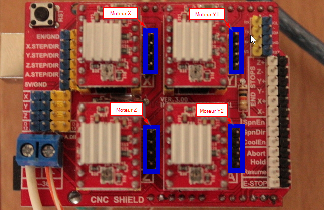
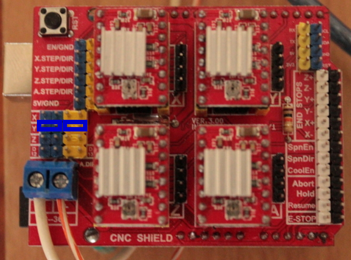
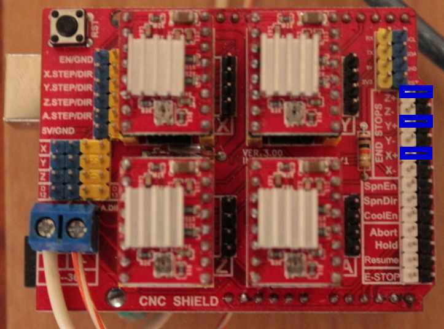

##########
Projet CNC
##########

Construction de la CNC 
======================

Branchements et configuration de la carte cnc-shield
----------------------------------------------------

A la réception de l'arduino cnc shield, l'absence de doc nous laisse
un peu coi... Heureusement, le blog Protoneer_ donne de précieuses
informations.

Branchement des moteurs
~~~~~~~~~~~~~~~~~~~~~~~

Il faut simplement brancher les 4 moteurs sur les slots :

       
   Branchement des moteurs

Le sens des cables n'a pas d'importance, il faut juste veiller à ce
qu'ils soient tous branchés pareils (bleu en haut par exemple). Le
réglage du sens des mouvement se fera ultérieurement.

Synchroniser les deux moteurs sur l'axe Y
~~~~~~~~~~~~~~~~~~~~~~~~~~~~~~~~~~~~~~~~~

Comme nous avons 2 axes Y commendés par 2 moteurs, nous les
synchronisons en ajoutons 2 jumpers (en bleu sur la figure)

       
   Jumper à placer pour synchroniser les moteurs Y

Il faut ensuite brancher les 2 moteurs sur les connecteurs Y et A.

Activation des capteurs de fin de course
~~~~~~~~~~~~~~~~~~~~~~~~~~~~~~~~~~~~~~~~

Les capteurs de fin de course sont importants. Ils permettent de
recalibrer les positions des 3 axes en cas de glissement lors d'un
précédent mouvement.

3 capteurs sont nécessaire, à brancher au niveau de la cate (END STOPS).

    

Controller sur un raspberry
---------------------------

L'idée est de pouvoir controller en temps réel notre CNC. Pour cela, nous allons utiliser un raspberry surlequel nous installons

Deport d'écran
--------------

Pour éviter de rester dans le garage pendant que la CNC travail, on va
installer le serveur vncserver sur le raspi afin de pouvoir travailler
en déport d'écran !

Sur le raspi

    $ sudo apt install vnc4server
    $ vncpasswd
    Password:
    Verify:
    Would you like to enter a view-only password (y/n)? y
    Password:
    Verify:

    $ vncserver -localhost no

Sur la machine de controles

    $ remmina

2 parties :

$ sudo apt install java-common

- Controle des moteurs via arduino  => GRBL (exécution de gcode)

- Execution de jcode et controle de l'arduibno bCNC

Controle Arduino (GRBL)
------------------------

L'ensemble des mouvements est réalisé par de l'interprétation de
langage, le gcode. Nous allons utiliser le soft GRBL pour cela.

Compilation de GRBL
~~~~~~~~~~~~~~~~~~~

Installation de l'environnement de compilation
~~~~~~~~~~~~~~~~~~~~~~~~~~~~~~~~~~~~~~~~~~~~~~

Il faut tout d'abord mettre en place l'environnement de Compilation_ pour pouvoir configurer GRBL.

	$ sudo apt update
	$ sudo apt upgrade

Installation de gcc-avr

	$ sudo apt install gcc-avr binutils-avr avr-libc gdb-avr

Tout est prêt pour compiler GRBL. Il faut tout d'abord le récupérer
sur [github](https://github.com/grbl/grbl).

	$ mkdir grbl
	$ unzip grbl-master.zip
	$ cd grbl-master
	$ make clean; make all

Configuration 'on-line' de GRBL
~~~~~~~~~~~~~~~~~~~~~~~~~~~~~~~

- Direction de déplacement

  Il faut tout d'abord configurer le sens de déplacement des 3 axes.
  
  .. figure:: images/setup-homing.png 
   :width: 60%
  
  $3=0 (dir port invert mask:00000000)

- Homing

  La capacité de la CNC a se recalibré sur un point de référence (0,0,0)
  est crucial. Le principe consiste en faisant déplacer chaque axe
  jusqu'a ce qu'il rencontre le capteur de butée.

  Dans notre cas, les butées sont positionnées en (0,0,0), ce qui veut
  dire que pour trouver les butées la CNC doit faire décroitre les
  positions de chaque axe. 
  
  .. figure:: images/setup-homing.png 
   :width: 60%

  Etonnament, ce n'est pas le comportement par défaut de GRBL. Aussi nous devons modifier le paramètre homing-dir-invert-mask_ ($23) lui donner la valeur 7 (qui correspond à la valeur de mask:00000111) avec :
     - 00000001: recherche butée -X
     - 00000010: recherche butée -Y
     - 00000100: recherche butée -Z

  Il faut également activer le mode homing cycle en affectant 1 au paramètre homing-cycle-boolean_ ($22).
  
  
Pour cela, j'ai suivi un [tuto](https://www.cours-gratuit.com/cours-arduino/tutoriel-arduino-et-grbl-avec-cnc-shield-v3-pdf) plutot sympa.

TODO:
   Inverser Z (lire https://github.com/gnea/grbl/wiki/Grbl-v1.1-Configuration#22---homing-cycle-boolean)

Résumé
~~~~~~

Voici l'ensemble des paramètres à appliquer :

::
   $22=1
   $23=7

La personnalisation se fait à partir du fichier grbl/default.h qui
fait un include sur grbl/default/default_<CNC>.h
#### Fichier default.h
Par default, il pointe sur le fichier grbl/default/default_generic.h

On va donc "dériver" grbl/default/default_generic.h en grbl/default/default_yacnc.h

::

    $ cp grbl/grbl-master/grbl/defaults/defaults_generic.h grbl/grbl-master/grbl/defaults/defaults_yacnc.h

- faire point le default.h dessus. Editer le fichier drbl/default.h et changer ajouter :

    ::

        #ifdef DEFAULTS_YACNC
           #include "default/defaults_yacnc.h"
        #endif

Configuration de default_yacnc.h
~~~~~~~~~~~~~~~~~~~~~~~~~~~~~~~~~

Le fichier default_yacnc.h (Yet Another CNC) va contenir l'ensemble
des caractéristiques de notre CNC. Pour cela il faut :

https://lebearcnc.com/configurer-et-parametrer-grbl/

Les premiers paramètres sont liés aux caractéristiques des moteurs pas à pas ainsi que les pas de vis:

::

    #define MOTOR_STP 200 // number of step per turn (Angle de pas : 1.8 degree)
    #define MICRO_STP 16  // Micro stepping 1/16 step ? TODO: valide 1?
    #define SCREW_PITCH_MM 2 // Pas de 2mm pour les vis sans fin

Ce qui permet de déduire le nombre de tour pour avancer d'1 mm :

::

    // Grbl generic default settings. Should work across different machines.
    #define DEFAULT_X_STEPS_PER_MM (MICRO_STP*MOTOR_STP/SCREW_PITCH_MM)
    #define DEFAULT_Y_STEPS_PER_MM (MICRO_STP*MOTOR_STP/SCREW_PITCH_MM)
    #define DEFAULT_Z_STEPS_PER_MM (MICRO_STP*MOTOR_STP/SCREW_PITCH_MM)

On définit ensuite la course max de chaque axe (mm) :

::

    #define DEFAULT_X_MAX_TRAVEL 240.0 // mm // (130) TODO
    #define DEFAULT_Y_MAX_TRAVEL 480.0 // mm // (131) TODO
    #define DEFAULT_Z_MAX_TRAVEL 75.0 // mm // (132) TODO

Les vitesses max :

::

    #define DEFAULT_X_MAX_RATE 380.0 // (110) mm/min
    #define DEFAULT_Y_MAX_RATE 380.0 // (111) mm/min
    #define DEFAULT_Z_MAX_RATE 220.0 // (112) mm/min

Enfin on active les detecteurs de fin de course

::

    #define DEFAULT_HOMING_ENABLE 1  // activation des detecteurs de fin de course
    #define DEFAULT_HOMING_DIR_MASK 0 // move positive dir
    #define DEFAULT_HOMING_FEED_RATE 25.0 // (24) Vitesse lente/précise (mm/min)
    #define DEFAULT_HOMING_SEEK_RATE 380.0 // (25) Vitesse de déplacement jusqu'à déclencher les capteurs mm/min
    #define DEFAULT_HOMING_DEBOUNCE_DELAY 250 // (26) msec (0-65k) Tps de filtrage de rebond du capteur
    #define DEFAULT_HOMING_PULLOFF 1.0 // (27) mm decalage des fins des capteurs                                     

Configuration de config.h
~~~~~~~~~~~~~~~~~~~~~~~~~
Pour activer la configuration yacnc, il faut remplacer la ligne :

	  #define DEFAULTS_GENERIC

par

      #define DEFAULTS_YACNC

Compilation
~~~~~~~~~~~

Trouver le port usb de connexion avec l'arduino

    $ python -m serial.tools.list_ports

Puis lancer la compilation :

    	$ make

Flasher l'arduino

    $ make flash

    https://github.com/gnea/grbl/wiki/Grbl-v1.1-Configuration#20---soft-limits-boolean

Lancer un terminal serie :

    $ python -m serial.tools.miniterm /dev/ttyACM0 115200

Slicing d'une piece
-------------------

http://www.metabricoleur.com/t401-cn-du-dessin-a-la-piece-debutants
   
------

.. _Compilation: http://maxembedded.com/2015/06/setting-up-avr-gcc-toolchain-on-linux-and-mac-os-x/

.. _Protoneer: https://blog.protoneer.co.nz/arduino-cnc-shield-v3-00-assembly-guide/

.. _homing-cycle-boolean: https://github.com/gnea/grbl/wiki/Grbl-v1.1-Configuration#22---homing-cycle-boolean

.. _homing-dir-invert-mask: https://github.com/gnea/grbl/wiki/Grbl-v1.1-Configuration#23---homing-dir-invert-mask
